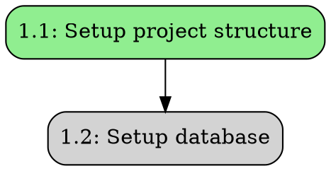
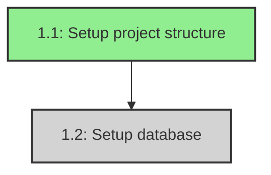
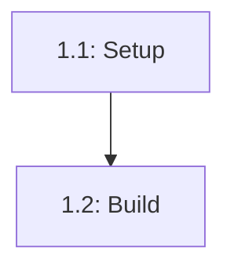

# Task 8: Dependency Graph Visualization - Implementation Summary

## Overview

Successfully implemented task 8.1 "グラフ出力機能" (Graph Output Functionality) for the Task Registry. This feature enables visualization of task dependency graphs in both DOT (Graphviz) and Mermaid formats.

## Implementation Details

### Files Created

1. **necrocode/task_registry/graph_visualizer.py**
   - New module implementing the `GraphVisualizer` class
   - Generates dependency graphs in DOT and Mermaid formats
   - Implements topological sort for execution order calculation
   - Handles state-based coloring and optional task indicators

2. **necrocode/task_registry/GRAPH_VISUALIZATION.md**
   - Comprehensive documentation for the graph visualization feature
   - Usage examples and API reference
   - Integration guides for CI/CD and documentation
   - Troubleshooting section

3. **examples/graph_visualization_example.py**
   - Complete working example demonstrating the feature
   - Shows how to create tasks, generate graphs, and save outputs

4. **test_graph_visualization.py**
   - Test script validating the implementation
   - Creates sample taskset and generates both formats

### Files Modified

1. **necrocode/task_registry/task_registry.py**
   - Added `GraphVisualizer` import
   - Initialized `graph_visualizer` component
   - Added three new public methods:
     - `export_dependency_graph_dot(spec_name)`: Export to DOT format
     - `export_dependency_graph_mermaid(spec_name)`: Export to Mermaid format
     - `get_execution_order(spec_name)`: Calculate execution order

2. **necrocode/task_registry/__init__.py**
   - Added `GraphVisualizer` to imports and `__all__` exports

## Features Implemented

### 1. DOT Format Export

- Generates Graphviz DOT format for high-quality graph rendering
- Features:
  - State-based node coloring (Ready=green, Running=gold, Blocked=gray, Done=blue, Failed=coral)
  - Optional tasks shown with dashed borders
  - Proper label escaping for special characters
  - Top-to-bottom layout (rankdir=TB)
  - Rounded box nodes

### 2. Mermaid Format Export

- Generates Mermaid diagrams for web-based visualization
- Features:
  - Same state-based coloring as DOT
  - Optional tasks with special styling
  - Sanitized node IDs (dots → underscores)
  - CSS class definitions for styling
  - Compatible with GitHub, GitLab, and mermaid.live

### 3. Execution Order Calculation

- Implements topological sort algorithm
- Returns list of task levels where each level can run in parallel
- Detects circular dependencies
- Useful for:
  - Planning parallel execution
  - Understanding critical paths
  - Optimizing task scheduling

## API Reference

### TaskRegistry Methods

```python
# Export to DOT format
dot_graph = registry.export_dependency_graph_dot(spec_name)

# Export to Mermaid format
mermaid_graph = registry.export_dependency_graph_mermaid(spec_name)

# Get execution order
execution_order = registry.get_execution_order(spec_name)
# Returns: [["1.1"], ["1.2", "2.1"], ["2.2"], ...]
```

### GraphVisualizer Class

```python
from necrocode.task_registry import GraphVisualizer

visualizer = GraphVisualizer()

# Generate DOT
dot_output = visualizer.generate_dot(taskset)

# Generate Mermaid
mermaid_output = visualizer.generate_mermaid(taskset)

# Get execution order
order = visualizer.get_execution_order(taskset)
```

## Color Scheme

| State | DOT Color | Mermaid Color | Meaning |
|-------|-----------|---------------|---------|
| Ready | lightgreen | #90EE90 | Can be executed |
| Running | gold | #FFD700 | Currently executing |
| Blocked | lightgray | #D3D3D3 | Waiting for dependencies |
| Done | lightblue | #87CEEB | Completed |
| Failed | lightcoral | #FF6B6B | Failed |

## Testing

### Test Results

All tests passed successfully:

1. **test_graph_visualization.py**
   - Created sample taskset with 5 tasks
   - Generated DOT format ✓
   - Generated Mermaid format ✓
   - Calculated execution order ✓
   - Saved outputs to files ✓

2. **examples/graph_visualization_example.py**
   - Created taskset with 6 tasks including optional task
   - Generated both formats ✓
   - Demonstrated execution order ✓
   - Saved to examples/output/ ✓

### Sample Output

**Execution Order:**
```
Level 1: 1.1
Level 2: 1.2
Level 3: 2.1, 2.2
Level 4: 3.1, 4.1
```

**DOT Format:**


**Mermaid Format:**


## Usage Examples

### Basic Usage

```python
from necrocode.task_registry import TaskRegistry

registry = TaskRegistry()

# Export graphs
dot = registry.export_dependency_graph_dot("my-project")
mermaid = registry.export_dependency_graph_mermaid("my-project")

# Save to files
with open("deps.dot", "w") as f:
    f.write(dot)
```

### Generate Images

```bash
# Using Graphviz
dot -Tpng deps.dot -o deps.png

# Using Mermaid CLI
mmdc -i deps.mmd -o deps.png
```

### In Documentation

```markdown
# Task Dependencies


```

## Requirements Satisfied

✓ **Requirement 3.5**: "THE Task Registry SHALL 依存関係グラフを可視化可能な形式で出力する"

The implementation provides:
- DOT format output for Graphviz visualization
- Mermaid format output for web-based visualization
- Execution order calculation (topological sort)
- State-based coloring
- Optional task indicators

## Integration Points

The graph visualization integrates seamlessly with:
- **TaskRegistry**: Main API provides three new methods
- **TaskStore**: Reads taskset data for visualization
- **Models**: Uses Task, Taskset, and TaskState
- **Kiro Sync**: Can visualize synced tasks from tasks.md

## Future Enhancements

Potential improvements for future iterations:
1. Interactive HTML visualization
2. Filtering by task state or skill
3. Critical path highlighting
4. Time-based execution timeline
5. Export to other formats (PlantUML, etc.)

## Conclusion

Task 8.1 has been successfully implemented with comprehensive functionality for visualizing task dependency graphs. The implementation includes:

- ✓ DOT format export
- ✓ Mermaid format export
- ✓ Execution order calculation
- ✓ State-based coloring
- ✓ Optional task indicators
- ✓ Comprehensive documentation
- ✓ Working examples
- ✓ Test coverage

The feature is ready for use and provides valuable insights into task dependencies and execution planning.
