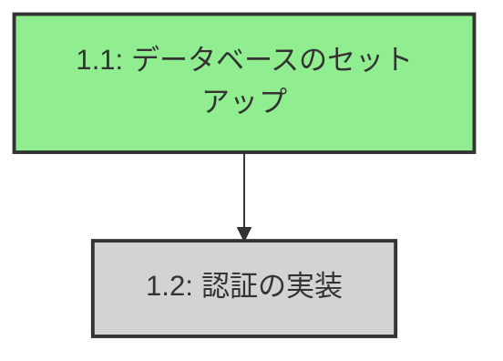
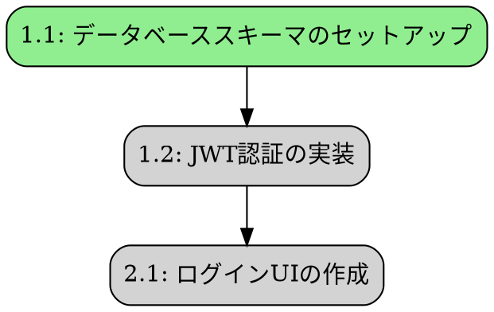
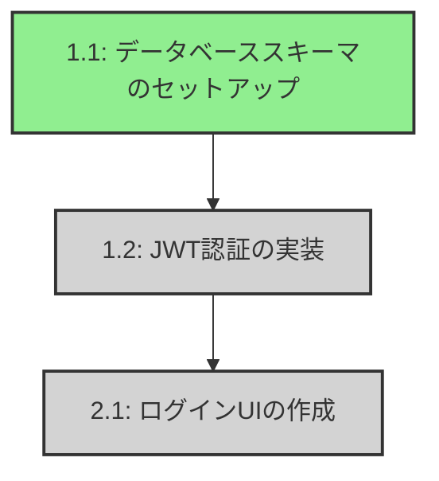

# タスクレジストリ - グラフ可視化

## 概要

タスクレジストリには、タスクの依存関係をDOT（Graphviz）形式とMermaid形式の両方で可視化できる強力なグラフ可視化機能が含まれています。これにより、タスクの依存関係の構造を理解し、実行順序を計画できます。

## 機能

- **DOT形式エクスポート**: 高品質なグラフレンダリング用のGraphviz DOTファイルを生成
- **Mermaid形式エクスポート**: Webベースの可視化が容易なMermaidダイアグラムを生成
- **状態ベースの色分け**: タスクは現在の状態（準備完了、実行中、ブロック中、完了、失敗）に基づいて色分けされます
- **オプションタスクの表示**: オプションタスクは破線の枠で視覚的に区別されます
- **実行順序の計算**: トポロジカルソートによる最適なタスク実行順序の決定

## 使用方法

### 基本的な使用例

```python
from necrocode.task_registry import TaskRegistry

# レジストリを初期化
registry = TaskRegistry()

# タスクセットを作成または読み込み
spec_name = "my-project"

# DOT形式にエクスポート
dot_graph = registry.export_dependency_graph_dot(spec_name)
print(dot_graph)

# Mermaid形式にエクスポート
mermaid_graph = registry.export_dependency_graph_mermaid(spec_name)
print(mermaid_graph)

# 実行順序を取得
execution_order = registry.get_execution_order(spec_name)
for level, task_ids in enumerate(execution_order, 1):
    print(f"レベル {level}: {', '.join(task_ids)}")
```

### ファイルへの保存

```python
from pathlib import Path

# DOT形式で保存
dot_file = Path("output/dependencies.dot")
dot_file.parent.mkdir(exist_ok=True)
with open(dot_file, "w") as f:
    f.write(registry.export_dependency_graph_dot(spec_name))

# Mermaid形式で保存
mermaid_file = Path("output/dependencies.mmd")
with open(mermaid_file, "w") as f:
    f.write(registry.export_dependency_graph_mermaid(spec_name))
```

## 可視化方法

### 1. DOT形式（Graphviz）

DOT形式は高品質な静的画像の生成に最適です。

**インストール:**
```bash
# macOS
brew install graphviz

# Ubuntu/Debian
sudo apt-get install graphviz

# Windows
# https://graphviz.org/download/ からダウンロード
```

**画像を生成:**
```bash
# PNG形式
dot -Tpng dependencies.dot -o dependencies.png

# SVG形式（スケーラブル）
dot -Tsvg dependencies.dot -o dependencies.svg

# PDF形式
dot -Tpdf dependencies.dot -o dependencies.pdf
```

**DOT出力の特徴:**
- ノードはタスクの状態に基づいて色分けされます：
  - **ライトグリーン**: 準備完了（実行可能）
  - **ゴールド**: 実行中（現在実行中）
  - **ライトグレー**: ブロック中（依存関係を待機中）
  - **ライトブルー**: 完了（完了済み）
  - **ライトコーラル**: 失敗
- オプションタスクは破線の枠で表示されます
- 矢印は依存関係を示します（A → B は B が A に依存することを意味します）

### 2. Mermaid形式

MermaidはドキュメントやWebベースの可視化に最適です。

**オンライン可視化:**
1. Mermaid出力をコピー
2. https://mermaid.live/ にアクセス
3. コンテンツを貼り付け
4. ダイアグラムを表示してエクスポート

**CLIツール:**
```bash
# Mermaid CLIをインストール
npm install -g @mermaid-js/mermaid-cli

# PNGを生成
mmdc -i dependencies.mmd -o dependencies.png

# SVGを生成
mmdc -i dependencies.mmd -o dependencies.svg
```

**MarkdownでのMermaid:**
Mermaidダイアグラムを直接Markdownファイルに埋め込むことができます：

````markdown

````

## カラースキーム

### タスクの状態

| 状態 | DOTの色 | Mermaidの色 | 意味 |
|-------|-----------|---------------|---------|
| Ready | ライトグリーン | #90EE90 | タスクは実行可能 |
| Running | ゴールド | #FFD700 | タスクは現在実行中 |
| Blocked | ライトグレー | #D3D3D3 | 依存関係を待機中 |
| Done | ライトブルー | #87CEEB | タスク完了 |
| Failed | ライトコーラル | #FF6B6B | タスク失敗 |

### 特別な表示

- **オプションタスク**: 破線の枠（DOTとMermaidの両方）
- **通常タスク**: 実線の枠

## 実行順序

`get_execution_order()`メソッドは、タスクレベルのリストを返します。各レベルには並列実行可能なタスクが含まれます：

```python
execution_order = registry.get_execution_order("my-project")

# 出力例:
# [
#   ["1.1"],              # レベル1: タスク1.1のみ実行可能
#   ["1.2", "2.1"],       # レベル2: タスク1.2と2.1を並列実行可能
#   ["2.2"],              # レベル3: レベル2の後にタスク2.2を実行可能
#   ["3.1"]               # レベル4: タスク3.1を最後に実行
# ]
```

これは以下の用途に役立ちます：
- 並列実行の計画
- クリティカルパスの理解
- タスクスケジューリングの最適化
- ボトルネックの特定

## 出力例

### DOT形式


### Mermaid形式


## APIリファレンス

### TaskRegistryメソッド

#### `export_dependency_graph_dot(spec_name: str) -> str`

依存関係グラフをDOT形式でエクスポートします。

**パラメータ:**
- `spec_name`: 仕様/タスクセットの名前

**戻り値:**
- DOT形式の文字列

**例外:**
- `TasksetNotFoundError`: タスクセットが存在しない場合

#### `export_dependency_graph_mermaid(spec_name: str) -> str`

依存関係グラフをMermaid形式でエクスポートします。

**パラメータ:**
- `spec_name`: 仕様/タスクセットの名前

**戻り値:**
- Mermaid形式の文字列

**例外:**
- `TasksetNotFoundError`: タスクセットが存在しない場合

#### `get_execution_order(spec_name: str) -> List[List[str]]`

トポロジカルソートを使用して実行順序を計算します。

**パラメータ:**
- `spec_name`: 仕様/タスクセットの名前

**戻り値:**
- レベルのリスト。各レベルには並列実行可能なタスクIDが含まれます

**例外:**
- `TasksetNotFoundError`: タスクセットが存在しない場合

### GraphVisualizerクラス

`GraphVisualizer`クラスは直接使用することもできます：

```python
from necrocode.task_registry import GraphVisualizer, Taskset

visualizer = GraphVisualizer()

# DOTを生成
dot_output = visualizer.generate_dot(taskset)

# Mermaidを生成
mermaid_output = visualizer.generate_mermaid(taskset)

# 実行順序を取得
order = visualizer.get_execution_order(taskset)
```

## 統合例

### CI/CDとの統合

CIパイプラインでグラフを自動生成：

```yaml
# .github/workflows/visualize-tasks.yml
name: タスク依存関係の可視化

on: [push]

jobs:
  visualize:
    runs-on: ubuntu-latest
    steps:
      - uses: actions/checkout@v2
      
      - name: Pythonのセットアップ
        uses: actions/setup-python@v2
        with:
          python-version: '3.11'
      
      - name: 依存関係のインストール
        run: |
          pip install -r requirements.txt
          sudo apt-get install graphviz
      
      - name: グラフの生成
        run: python scripts/generate_graphs.py
      
      - name: アーティファクトのアップロード
        uses: actions/upload-artifact@v2
        with:
          name: dependency-graphs
          path: output/*.png
```

### ドキュメントとの統合

プロジェクトドキュメントにグラフを含める：

```python
# docs/generate_docs.py
from necrocode.task_registry import TaskRegistry
from pathlib import Path

registry = TaskRegistry()
spec_name = "my-project"

# ドキュメント用のMermaidを生成
mermaid = registry.export_dependency_graph_mermaid(spec_name)

# ドキュメントに書き込み
docs_file = Path("docs/task-dependencies.md")
with open(docs_file, "w") as f:
    f.write("# タスクの依存関係\n\n")
    f.write("```mermaid\n")
    f.write(mermaid)
    f.write("\n```\n")
```

## トラブルシューティング

### 循環依存関係

循環依存関係がある場合、実行順序の最終レベルに残りのタスクがすべて含まれます：

```python
execution_order = registry.get_execution_order("my-project")
# 循環依存関係が存在する場合:
# [..., ["task-a", "task-b", "task-c"]]  # すべて同じレベルにあることは循環を示します
```

### 大規模なグラフ

多数のタスク（50以上）を持つタスクセットの場合、以下を検討してください：
- より良いスケーラビリティのためにSVG形式を使用
- 可視化前に状態でタスクをフィルタリング
- コンポーネントごとにサブグラフに分割

### 特殊文字

特殊文字を含むタスクタイトルは自動的にエスケープされます：
- DOT: 引用符とバックスラッシュがエスケープされます
- Mermaid: IDがサニタイズされます（ドットはアンダースコアになります）

## 関連ドキュメント

- [タスクレジストリ README](README.md) - メインドキュメント
- [設計ドキュメント](../../.kiro/specs/task-registry/design.md) - アーキテクチャの詳細
- [要件](../../.kiro/specs/task-registry/requirements.md) - 機能要件
