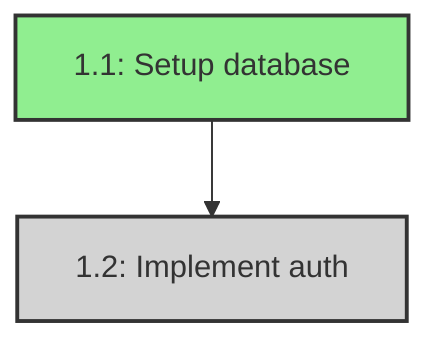
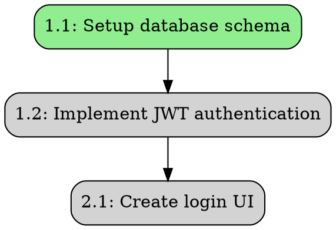
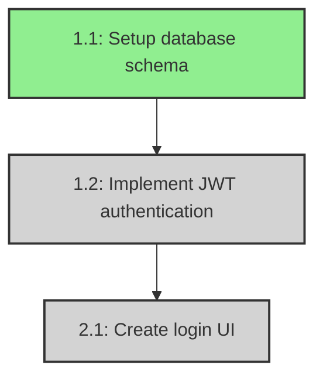

# Task Registry - Graph Visualization

## Overview

The Task Registry includes powerful graph visualization capabilities that allow you to visualize task dependencies in both DOT (Graphviz) and Mermaid formats. This helps you understand the structure of your task dependencies and plan execution order.

## Features

- **DOT Format Export**: Generate Graphviz DOT files for high-quality graph rendering
- **Mermaid Format Export**: Generate Mermaid diagrams for easy web-based visualization
- **State-based Coloring**: Tasks are colored based on their current state (Ready, Running, Blocked, Done, Failed)
- **Optional Task Indication**: Optional tasks are visually distinguished with dashed borders
- **Execution Order Calculation**: Topological sort to determine optimal task execution order

## Usage

### Basic Example

```python
from necrocode.task_registry import TaskRegistry

# Initialize registry
registry = TaskRegistry()

# Create or load a taskset
spec_name = "my-project"

# Export to DOT format
dot_graph = registry.export_dependency_graph_dot(spec_name)
print(dot_graph)

# Export to Mermaid format
mermaid_graph = registry.export_dependency_graph_mermaid(spec_name)
print(mermaid_graph)

# Get execution order
execution_order = registry.get_execution_order(spec_name)
for level, task_ids in enumerate(execution_order, 1):
    print(f"Level {level}: {', '.join(task_ids)}")
```

### Saving to Files

```python
from pathlib import Path

# Save DOT format
dot_file = Path("output/dependencies.dot")
dot_file.parent.mkdir(exist_ok=True)
with open(dot_file, "w") as f:
    f.write(registry.export_dependency_graph_dot(spec_name))

# Save Mermaid format
mermaid_file = Path("output/dependencies.mmd")
with open(mermaid_file, "w") as f:
    f.write(registry.export_dependency_graph_mermaid(spec_name))
```

## Visualization Methods

### 1. DOT Format (Graphviz)

The DOT format is ideal for generating high-quality static images.

**Installation:**
```bash
# macOS
brew install graphviz

# Ubuntu/Debian
sudo apt-get install graphviz

# Windows
# Download from https://graphviz.org/download/
```

**Generate Images:**
```bash
# PNG format
dot -Tpng dependencies.dot -o dependencies.png

# SVG format (scalable)
dot -Tsvg dependencies.dot -o dependencies.svg

# PDF format
dot -Tpdf dependencies.dot -o dependencies.pdf
```

**DOT Output Features:**
- Nodes are colored based on task state:
  - **Light Green**: Ready (can be executed)
  - **Gold**: Running (currently executing)
  - **Light Gray**: Blocked (waiting for dependencies)
  - **Light Blue**: Done (completed)
  - **Light Coral**: Failed
- Optional tasks have dashed borders
- Arrows show dependency relationships (A → B means B depends on A)

### 2. Mermaid Format

Mermaid is perfect for documentation and web-based visualization.

**Online Visualization:**
1. Copy the Mermaid output
2. Go to https://mermaid.live/
3. Paste the content
4. View and export the diagram

**CLI Tool:**
```bash
# Install Mermaid CLI
npm install -g @mermaid-js/mermaid-cli

# Generate PNG
mmdc -i dependencies.mmd -o dependencies.png

# Generate SVG
mmdc -i dependencies.mmd -o dependencies.svg
```

**Mermaid in Markdown:**
You can embed Mermaid diagrams directly in Markdown files:

````markdown

````

## Color Scheme

### Task States

| State | DOT Color | Mermaid Color | Meaning |
|-------|-----------|---------------|---------|
| Ready | Light Green | #90EE90 | Task can be executed |
| Running | Gold | #FFD700 | Task is currently executing |
| Blocked | Light Gray | #D3D3D3 | Waiting for dependencies |
| Done | Light Blue | #87CEEB | Task completed |
| Failed | Light Coral | #FF6B6B | Task failed |

### Special Indicators

- **Optional Tasks**: Dashed border (both DOT and Mermaid)
- **Regular Tasks**: Solid border

## Execution Order

The `get_execution_order()` method returns a list of task levels, where each level contains tasks that can be executed in parallel:

```python
execution_order = registry.get_execution_order("my-project")

# Example output:
# [
#   ["1.1"],              # Level 1: Only task 1.1 can run
#   ["1.2", "2.1"],       # Level 2: Tasks 1.2 and 2.1 can run in parallel
#   ["2.2"],              # Level 3: Task 2.2 can run after level 2
#   ["3.1"]               # Level 4: Task 3.1 runs last
# ]
```

This is useful for:
- Planning parallel execution
- Understanding critical paths
- Optimizing task scheduling
- Identifying bottlenecks

## Example Output

### DOT Format


### Mermaid Format


## API Reference

### TaskRegistry Methods

#### `export_dependency_graph_dot(spec_name: str) -> str`

Export dependency graph in DOT format.

**Parameters:**
- `spec_name`: Name of the spec/taskset

**Returns:**
- DOT format string

**Raises:**
- `TasksetNotFoundError`: If taskset doesn't exist

#### `export_dependency_graph_mermaid(spec_name: str) -> str`

Export dependency graph in Mermaid format.

**Parameters:**
- `spec_name`: Name of the spec/taskset

**Returns:**
- Mermaid format string

**Raises:**
- `TasksetNotFoundError`: If taskset doesn't exist

#### `get_execution_order(spec_name: str) -> List[List[str]]`

Calculate execution order using topological sort.

**Parameters:**
- `spec_name`: Name of the spec/taskset

**Returns:**
- List of levels, each containing task IDs that can run in parallel

**Raises:**
- `TasksetNotFoundError`: If taskset doesn't exist

### GraphVisualizer Class

The `GraphVisualizer` class can also be used directly:

```python
from necrocode.task_registry import GraphVisualizer, Taskset

visualizer = GraphVisualizer()

# Generate DOT
dot_output = visualizer.generate_dot(taskset)

# Generate Mermaid
mermaid_output = visualizer.generate_mermaid(taskset)

# Get execution order
order = visualizer.get_execution_order(taskset)
```

## Integration Examples

### With CI/CD

Generate graphs automatically in your CI pipeline:

```yaml
# .github/workflows/visualize-tasks.yml
name: Visualize Task Dependencies

on: [push]

jobs:
  visualize:
    runs-on: ubuntu-latest
    steps:
      - uses: actions/checkout@v2
      
      - name: Setup Python
        uses: actions/setup-python@v2
        with:
          python-version: '3.11'
      
      - name: Install dependencies
        run: |
          pip install -r requirements.txt
          sudo apt-get install graphviz
      
      - name: Generate graphs
        run: python scripts/generate_graphs.py
      
      - name: Upload artifacts
        uses: actions/upload-artifact@v2
        with:
          name: dependency-graphs
          path: output/*.png
```

### With Documentation

Include graphs in your project documentation:

```python
# docs/generate_docs.py
from necrocode.task_registry import TaskRegistry
from pathlib import Path

registry = TaskRegistry()
spec_name = "my-project"

# Generate Mermaid for docs
mermaid = registry.export_dependency_graph_mermaid(spec_name)

# Write to docs
docs_file = Path("docs/task-dependencies.md")
with open(docs_file, "w") as f:
    f.write("# Task Dependencies\n\n")
    f.write("```mermaid\n")
    f.write(mermaid)
    f.write("\n```\n")
```

## Troubleshooting

### Circular Dependencies

If you have circular dependencies, the execution order will include all remaining tasks in the final level:

```python
execution_order = registry.get_execution_order("my-project")
# If circular dependency exists:
# [..., ["task-a", "task-b", "task-c"]]  # All in same level indicates cycle
```

### Large Graphs

For tasksets with many tasks (>50), consider:
- Using SVG format for better scalability
- Filtering tasks by state before visualization
- Breaking down into sub-graphs by component

### Special Characters

Task titles with special characters are automatically escaped:
- DOT: Quotes and backslashes are escaped
- Mermaid: IDs are sanitized (dots become underscores)

## See Also

- [Task Registry README](README.md) - Main documentation
- [Design Document](../../.kiro/specs/task-registry/design.md) - Architecture details
- [Requirements](../../.kiro/specs/task-registry/requirements.md) - Feature requirements
